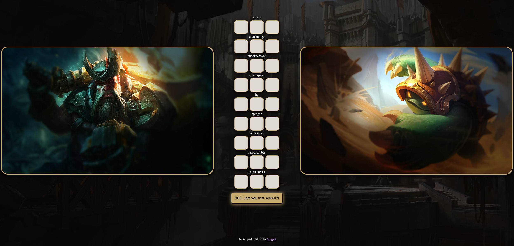

**Possible add-ons**:
- new game mods
- mobile version 
	- continuous scrolling pick which champ has the higher stat, one stat at a time 

**The project**: 
	The project did not present any particular challenges, it was mostly a problem of figuring out how I wanted to reach the end goal of testing the player knowledge/assumption about the champions stat. 
	**UI**: 
	Making a usable UI was not as easy as I expected, multiple version and Ideas had to be tried to eventually come to a somewhat decent solution:
	The page is not responsive but for a personal little project I don't feel like its too much of a problem. Choosing a colors is not as easy as one might think, the main color that I used for the accents is #c8aa6e a goldish hue typical of [[League of Legends]]. Even finding a good background was not as straight forward, I tried multiple good splash arts but what I found worked best was something that did not draw any attention to itself. Then to make the UI stand out I added a black layer and faded the background with opacity this way the artwork of the champions stands out. 
	**Backend**:
	It was quite straightforward lets wait for a hard project to develop a sense of how [[Rust]] impacted development 

**Key takeaways**: 
	Dedicating more time upfront to plan and realize possible blockers.
	The stack did not make the project harder or limit it, **try new things**.
	As always programming is fun.
	There are some issues with the "resource stat" not being always accurate, overall the game works fine. 
